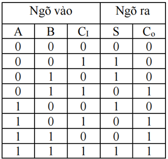
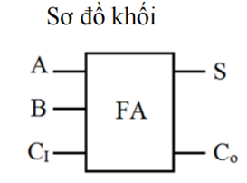

# Full Adder 

Mục tiêu: mô tả, phân tích và kiểm chứng mạch cộng đầy đủ (full adder) gồm 3 ngõ vào (A, B, CI) và 2 ngõ ra (S, CO).

## 1. Lý thuyết cơ bản
- Hàm tổng (S): S = (A ⊕ B) ⊕ CI
- Hàm carry-out (CO): CO = A·B + (A ⊕ B)·CI

Giải thích ngắn: S là phép cộng modulo-2 của ba bit, CO xuất hiện khi có ít nhất hai trong ba bit là 1.

## 2. Bảng trạng thái (truth table)



## 3. Sơ đồ khối

## 4. Mã Verilog (mô-đun thực tế)


````verilog

module fulladder(
    input  wire a,
    input  wire b,
    input  wire ci,
    output wire s,
    output wire co
);
    assign s  = a ^ b ^ ci;
    assign co = (a & b) | ((a ^ b) & ci);
endmodule
