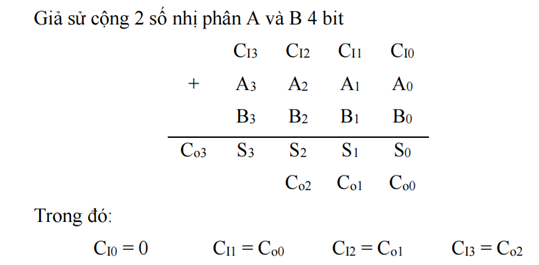
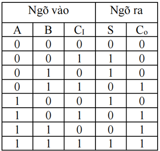
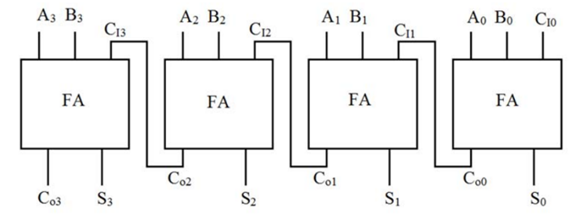
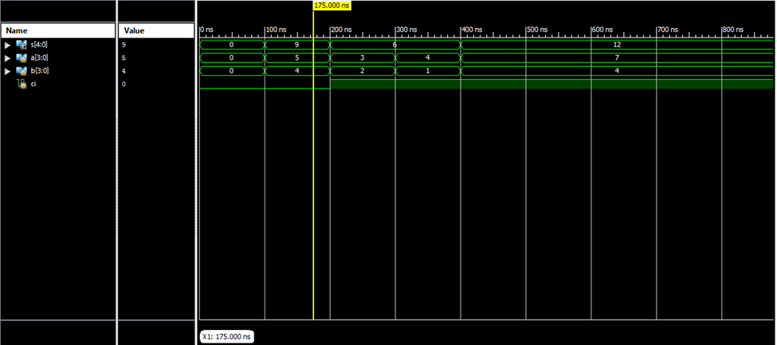

# Full Adder 4 bit 


## 1. Lý thuyết cơ bản


## 2. Bảng trạng thái (truth table)



## 3. Sơ đồ khối

## 4. Mã Verilog (mô-đun thực tế)


````verilog

module full4bit(
input [3:0] a,b,
input ci,
output [4:0]s
    );
wire c0,c1,c2;
fulladder ff1 (a[0],b[0],ci,s[0],c0);
fulladder ff2 (a[1],b[1],c0,s[1],c1);
fulladder ff3 (a[2],b[2],c1,s[2],c2);
fulladder ff4 (a[3],b[3],c2,s[3],s[4]);


endmodule


````
## 5. Simulation

